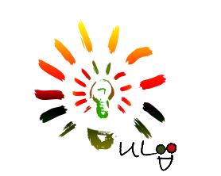

# Ulwazi Learning Development (ULD)

A modern, high-performance, premium web platform for **Ulwazi Learning Development** — a registered Non-Profit Organisation (NPO) in Cape Town, South Africa, dedicated to empowering vulnerable township youth through holiday programmes, life skills, and foundational education.



---

## 🚀 Tech Stack

- **Framework**: [Next.js 15 (App Router)](https://nextjs.org/)
- **Language**: [TypeScript](https://www.typescriptlang.org/)
- **Styling**: [Tailwind CSS v4](https://tailwindcss.com/)
- **Icons**: [Lucide React](https://lucide.dev/)
- **Animations & Glassmorphism**: Custom CSS, backdrop-blur filters, ambient glow gradients
- **Payment Processing**: Integrated PayPal Non-Profit Portal

---

## ✨ Features & Enhancements

1. **Premium Modern UI**:
   - Glassmorphic navigation header with ambient background blur and scroll-based elevation.
   - Dynamic background image carousel showcasing real township youth and holiday camp activities.
   - Rich warm dark palette (`#090d16`) with gold and emerald gradient highlights.

2. **Core Impact Sections**:
   - **Hero Section**: High-impact messaging (*"Learning Without Limits"*), live impact counters, and location badges.
   - **About Us**: Xhosa meaning of Ulwazi ("Knowledge"), core pillars, and community background.
   - **Our Plans & Purpose**: Our Start, Our Mission, and Our Vision breakdown.
   - **Founder Story**: Lumka Johannes profile narrative, quote showcase, and township background.
   - **Interactive Photo Gallery**: Category filter tabs (*All, Holiday Programmes, Outings, Workshops*) and lightbox view.
   - **Sponsors & Testimonials**: Spotlighting Nicky Davies, Yonela Johannes, and corporate partnership callout.
   - **Integrated Donation System**: Tiered impact selection (R150, R350, R750), PayPal integration, and quick popup modal.
   - **Interactive Contact Form**: Integrated with FormSubmit for direct inquiry routing to Lumka Johannes.

---

## 🛠️ Local Development

### Prerequisites
- Node.js v18+ (tested with v24)
- pnpm / npm / yarn

### Getting Started

```bash
# Install dependencies
pnpm install

# Run the development server
pnpm dev
```

Open [http://localhost:3000](http://localhost:3000) with your browser to view the application.

### Production Build

```bash
# Build production bundle
pnpm build

# Start production server
pnpm start
```

---

## 📂 Project Structure

```text
├── app/
│   ├── globals.css          # Tailwind imports & custom glassmorphism styles
│   ├── layout.tsx           # Root layout & Metadata configuration
│   └── page.tsx             # Main landing page combining all sections
├── components/
│   ├── Navbar.tsx           # Glassmorphic header & mobile navigation
│   ├── Hero.tsx             # Hero carousel & impact statistics
│   ├── AboutSection.tsx     # Purpose & core pillars
│   ├── OurPlans.tsx         # Mission, Start, Vision cards
│   ├── FounderSection.tsx   # Lumka Johannes founder story
│   ├── GallerySection.tsx   # Lightbox & filtered photo gallery
│   ├── SponsorsSection.tsx  # Sponsor testimonials
│   ├── DonationSection.tsx  # Tiered donation options & PayPal portal
│   ├── DonationModal.tsx    # Quick access donation dialog
│   ├── ContactSection.tsx   # Inquiry form & contact details
│   └── Footer.tsx           # Responsive footer & links
├── public/
│   ├── images/              # Activity & community photos
│   └── img/                 # Logo & brand assets
├── package.json
├── tsconfig.json
├── next.config.mjs
└── postcss.config.mjs
```

---

## 💙 Support Ulwazi Learning Development

Visit [ulwazilearningdevelopment.org](https://www.ulwazilearningdevelopment.org) to support our cause or get involved as a volunteer.
